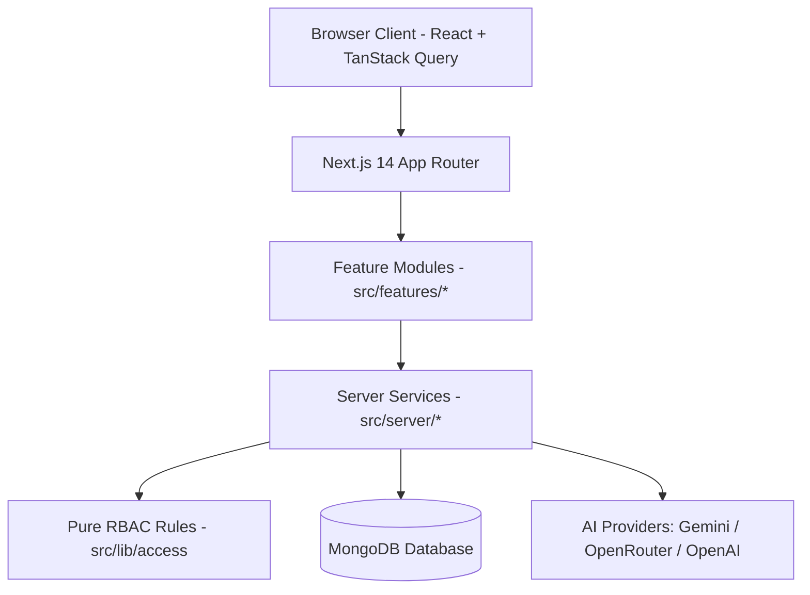
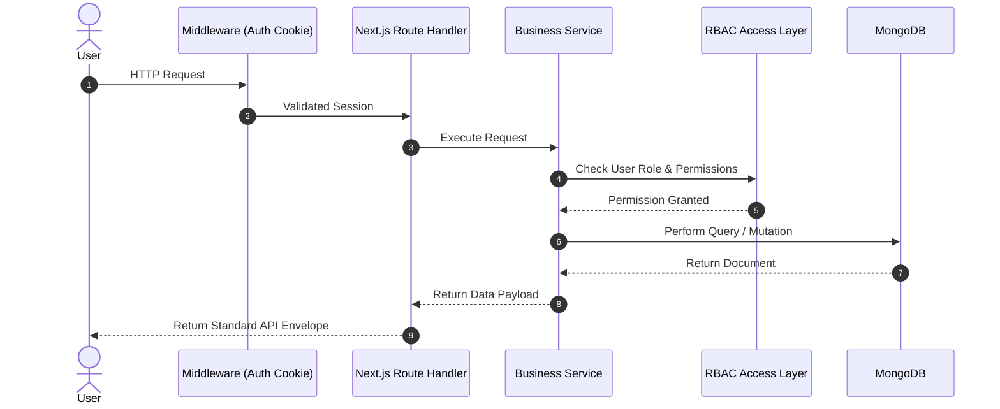
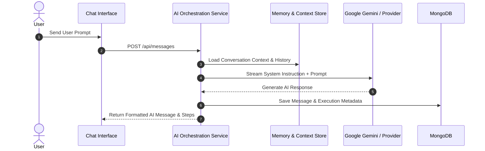

# 📊 ConverseOS Architecture Diagrams

## 1. High-Level System Architecture



---

## 2. Request Processing Flow



---

## 3. Chat Orchestration & AI Flow



---

## 4. Authentication & Workspace Scope Flow

```mermaid
graph TD
    Login[User Selects Account] --> Cookie[Set HttpOnly Session Cookie]
    Cookie --> Request[Request /[slug]/chat]
    Request --> Middleware[Check Cookie & Validate User]
    Middleware --> WorkspaceCheck[Verify User Access to Project Slug]
    WorkspaceCheck -->|Authorized| Render[Render Workspace Dashboard]
    WorkspaceCheck -->|Unauthorized| Redirect[Redirect to /login]
```
